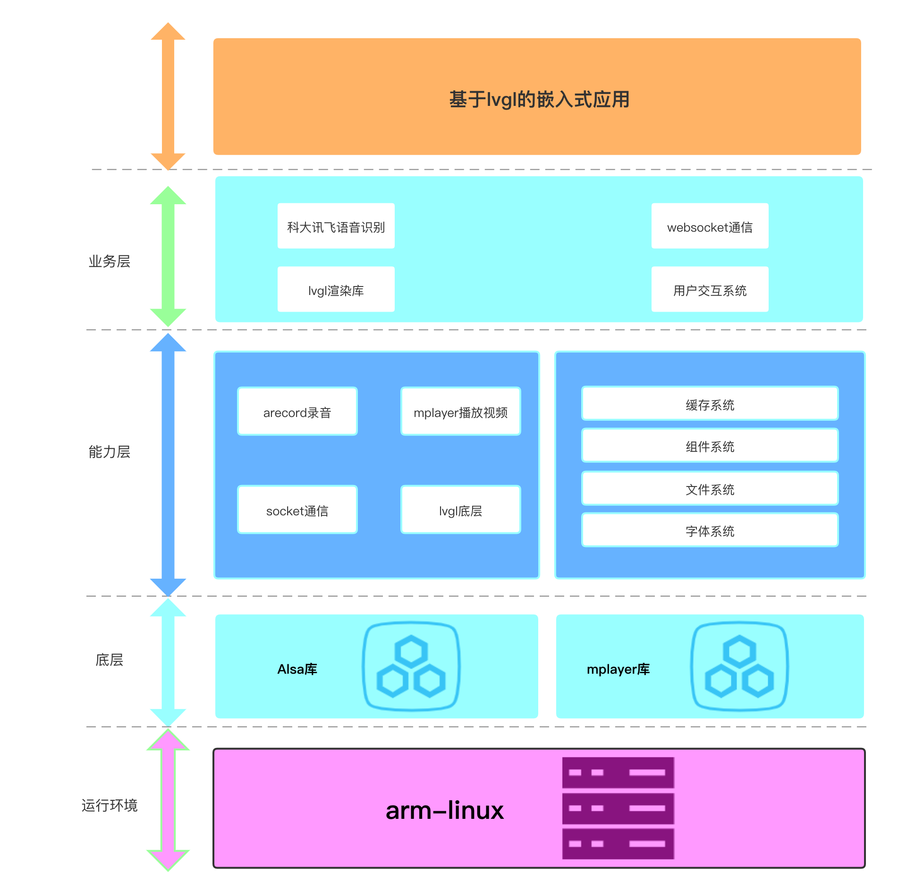
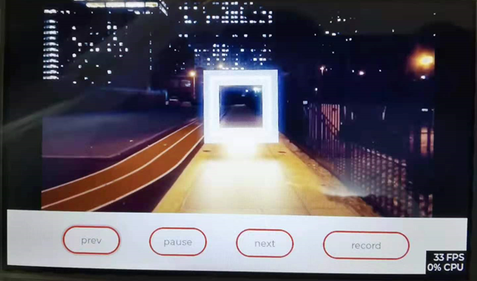

# 基于lvgl
## lvgl 版本号
v7.10
## 项目架构图

##  效果展示
<div align=center>  </center>

## 为什么要写这个？
1. 自带的lvgl库许多驱动不完善
2. 写入了font字体库（暂时无法使用，后续会修复）
3. 网上的lvgl库实在是太杂了。。没几个能用的。而官方的demo压根就没有做整合。而且lvgl更新过快，所以可能出现许许多多奇怪的问题。推荐大家暂时先不要使用8.0，8.0的驱动底层有许多更改，对嵌入Linux不是很友好。
4. 嵌入式学习了这个，就顺便写了一个，以后有机会会继续拿出来用和学习，也是第一次用C语言写这么大的项目，还是不喜欢C
## 说明
1. 这个lvgl是屏幕驱动适用于800x480的屏幕，触摸屏幕驱动中使用了偏移量进行校准。如果与您的型号不匹配可以自行去en_dev修改。
2. 对于Linux的socket通信已封装到socket.c中
3. 图片载入、字体载入目前存在一定问题，正在紧急修复，修复后会说明
4. go的语音识别服务端请见[serveserver目录](./server)、2文件夹目录为lvgl官方的font库（我已编译）。
## 使用方法
1. makefile文件已经编写好，使用make bin即可生成arm-linux-gcc版的文件，编译器以及编译标准可以自行在makefile文件内修改
2. socket服务端采用go语言编写，可以方便调用语音识别文件，大家可以自行根据自己需求进行修改
3. 可以通过make bin生成二进制文件，make lib（记得注释main）生成.so动态库文件
4. 推荐使用go进行开发，c适合底层，go更适合于业务层，包管理相对于c有更多优势。而且速度上与c不相上下，不过go编译的文件体积较大可以通过-ldflags "-s -w"删除调试信息压缩体积，如果体积过大不方便上潜入式可以采用upx -9 xxx(brew install upx;apt-get install upx)，还不满足再压缩成zip包或者tar包吧。
5. 新增语音识别功能，嵌入式设备通过alsa库录音后，将音频文件通过socket传输给电脑，电脑调用接口获取文字信息，通过文字信息可以做一些指令，后续整理后会将go程序发送到这。
6. make bin生成二进制文件，将main函数内的main主函数注释后，可以通过make lib生成库文件，后续可以导入go中，通过.h文件实现相应的功能。make clean可以删除链接好的文件，梳理心态。
7. 本目录下的upload与update_server分别挂载在虚拟机和嵌入式Linux内可以实现文件的快速上传（实测速度为800k/s），相对于串口上传速度有大幅度提升。
8. alsa库需要自行移植到嵌入式平台上，上传到服务器后可直接tar -zxvf alsa-1.0.tar.gz /usr/强制覆盖系统的库目录。
## 特别说明
本项目UI库采用lvgl，可以通过c直接调用，本人已封装部分函数到go，但工作量巨大，不是随随便便能完成的。后续有机会我会继续封装的，封装本身不难，难的是工作量，希望后续有人开发出自动移植cgo的程序。  
特别重要：Makefile文件记得修改成自己的编译器类型！！！必须使用c99以上标准（库中大量使用了诸如(for int)此类的文件声明）  
## 配置修改
### lv_conf.c（根目录）
主要需要修改分辨率以及屏幕深色还有最后的LV_MEM_SIZE（映射内存大小）  

```c
#define LV_HOR_RES_MAX          (800)
#define LV_VER_RES_MAX          (480)
#define LV_COLOR_DEPTH     32
#define LV_COLOR_16_SWAP   0
#define LV_COLOR_SCREEN_TRANSP    0
#define LV_COLOR_TRANSP    LV_COLOR_LIME         /*LV_COLOR_LIME: pure green*/
#define LV_INDEXED_CHROMA    1
#define LV_ANTIALIAS        1
#define LV_DISP_DEF_REFR_PERIOD      30      /*[ms]*/
#define LV_DPI              270     /*[px]*/
#define LV_DISP_SMALL_LIMIT  30
#define LV_DISP_MEDIUM_LIMIT 50
#define LV_DISP_LARGE_LIMIT  70
typedef int16_t lv_coord_t;
#define LV_MEM_CUSTOM      0
#if LV_MEM_CUSTOM == 0
/* Size of the memory used by `lv_mem_alloc` in bytes (>= 2kB)*/
#  define LV_MEM_SIZE    (64U * 1024U)
```
### lv_drv_conf.c
这个地方主要注意一下驱动的方式就行了
```c
#ifndef USE_FBDEV
#  define USE_FBDEV           1
#endif

#if USE_FBDEV
#  define FBDEV_PATH          "/dev/fb0"
#endif

#if USE_EVDEV
#  define EVDEV_NAME   "/dev/input/event0"        /*You can use the "evtest" Linux tool to get the list of devices and test them*/
#  define EVDEV_SWAP_AXES         0               /*Swap the x and y axes of the touchscreen*/
```
### 【特别注意】lvgl_drivers/indev/evdev.c
主要注意一下坐标的修正就可以了（适合屏幕就行）。
```c
				#else
					evdev_root_x = in.value * 800 / 1024;
				#endif
            else if(in.code == ABS_Y)
				#if EVDEV_SWAP_AXES
					evdev_root_x = in.value;
				#else
					evdev_root_y = in.value * 480 / 600;
				#endif
            else if(in.code == ABS_MT_POSITION_X)
                                #if EVDEV_SWAP_AXES
                                        evdev_root_y = in.value;
                                #else
                                        evdev_root_x = in.value * 800 / 1024;
                                #endif
            else if(in.code == ABS_MT_POSITION_Y)
                                #if EVDEV_SWAP_AXES
                                        evdev_root_x = in.value;
                                #else
                                        evdev_root_y = in.value * 480 / 600;
                                #endif
```
### go内的socket
注意就是修改IP地址，srv.Code是需要实时监听的，监听到变化后作出相应更改，有能力的可以做一个观察者模型。因能力有限，在此采用最蠢的轮回问候法。
```go
package main

import (
	"fmt"
	"log"
	"net"
	"os"
	srv "server/srv"
	"strings"
	//"strings"
	//"time"
)
func init(){
	srv.Code = -1
}
func process(conn2 net.Conn){
	defer conn2.Close()
	var f *os.File
	flag := 1
	for{
		if flag == 1{
			_ = os.Remove("1.pcm")
			_, _ = os.Create("1.pcm")
			f,_ = os.OpenFile("1.pcm",os.O_RDWR|os.O_CREATE|os.O_APPEND,0644)
			flag = 0
		}
		buf := make([]byte, 1024)
		n,_ := conn2.Read(buf)
		if n!= 0{
			if strings.Contains(string(buf),"myend666"){
				srv.Listen()
				fmt.Println("已更新")
				//读取所有的内容
				flag = 1
				continue//重新去读取
			}
			_, _ = f.Write(buf[:n])
		}

	}
}
func write(conn2 net.Conn){
	defer conn2.Close()
	fmt.Printf("准备给:%v发送消息\n",conn2.RemoteAddr())
	for{
		if srv.Code == 0 {
			fmt.Println("回传播放上一首")
			_,_ = conn2.Write([]byte("0"))
			srv.Code = -1
		}else if srv.Code == 1 {
			fmt.Println("回传播放下一首")
			_,_ = conn2.Write([]byte("1"))
			srv.Code = -1
		}else if srv.Code == 2 {
			fmt.Println("回传关灯")
			_,_ = conn2.Write([]byte("2"))
			srv.Code = -1
		}else if srv.Code == 3{
			fmt.Println("回传开灯")
			_,_ = conn2.Write([]byte("3"))
			srv.Code = -1
		}else if srv.Code == 4{
			fmt.Println("回传重启")
			_,_ = conn2.Write([]byte("4"))
			srv.Code = -1
		}else if srv.Code == 5{
			fmt.Println("回传暂停")
			_,_ = conn2.Write([]byte("5"))
			srv.Code = -1
		}else if srv.Code == 6{
			fmt.Println("回传播放")
			_,_ = conn2.Write([]byte("6"))
			srv.Code = -1
		}

	}

}
func main(){
	fmt.Println("服务器来了")
	listen,err := net.Listen("tcp","192.168.0.1:6666")
	if err != nil{
		log.Fatal(err)
	}
	defer listen.Close()
	for{
		//循环等待
		conn2,err := listen.Accept()
		if err != nil{
			log.Fatal(err)
		}
		fmt.Println("客户端Ip",conn2.RemoteAddr())
		go write(conn2)
		process(conn2)
	}
}
```
## issue
欢迎大家提出issue，本次更新后续不再维护更新。但是有issue会积极解答。